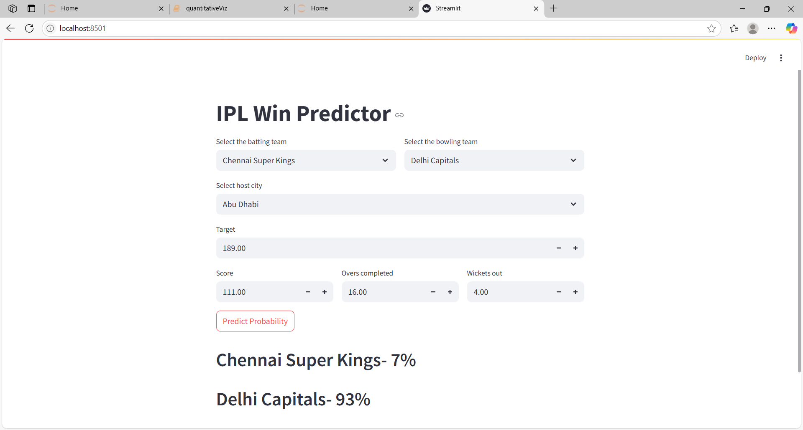

# 🏏 IPL Win Predictor

This project is a machine learning-based application that predicts the winning probability of an IPL (Indian Premier League) cricket team during a live match scenario. Given inputs like current score, overs, wickets, and other contextual data, it outputs the predicted win percentages for the batting and bowling teams.

---

##  Features

- Predict win probabilities based on match data
- Simple, interactive front-end (if applicable)
- Trained on historical IPL datasets
- Real-time input support (current score, overs, wickets, etc.)

---

##  Demo

---

##  Tech Stack

- **Python**
- **Scikit-learn / XGBoost / Other ML libraries**
- **Pandas, NumPy** – for data processing
- **Streamlit**  – for web interface
- **Matplotlib / Seaborn** (optional) – for data visualization

---

